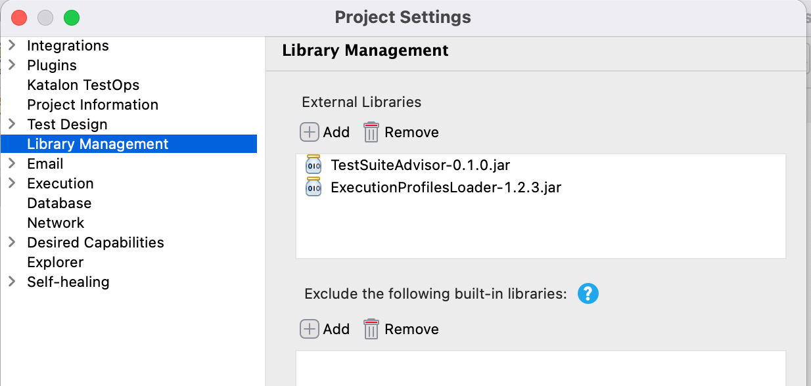

# How to let TestCases in a TestSuite to quit once a TestCase failed

## Problem to solve

A topic in the Katalon User Forum wrote:

- [Stop all test suite if one test case failed](https://forum.katalon.com/t/stop-all-test-suite-if-one-test-case-failed/49629)

>Hi,
>there is a way to stop a test suite if one of its cases fails?
>I need some method or form to stop the suite, does anyone have a solution?

Fair enough requirement, I think. 
Let me assume I have a Test Suite `TS1` is comprised with 3 Test Cases: `TC1`, `TC2`, `TC3`. 
 The `TC3` runs very long (e.g, 20 minutes). The `TC2` normally passes but occasionally fails.
When I run the `TS1` and unfortunately the `TC2` failed, I want the `TS1` stops as soon as the `TC2` failed.
I do not want to wait for the `TC3` to finish after 20 minutes.

However Katalon Studio does not support the feature to stop a Test Suite when a comprising Test Case failed.

What else can I do practically to let a Test Suite to finish as soon as a Test Case failed?

## Solution

I will not ask Katalon Studio to control if it should invoke each Test Cases (TC1, TC2, TC3) or not.
I will let it invoke all Test Cases in a Test Suite as defined.

Rather, I would write *each Test Cases to check if any of preceding Test Cases in the Test Suite has failed*. 
If there are any failed Test Cases, then a Test Case should quit immediately. A Test Case should check it before executing the body of test processes to prevent consuming time. I will introduce a few custom Groovy classes. A jar file that includes the module will be provided. Provided that Test Cases are informed of the results of preceding Test Cases, following Test Cases can be self-deterministic.

## Dependencies

At the [Releases](https://github.com/kazurayam/TestSuiteAdvisor/releases) page, you can download the jar of `TestSuiteAdvisor-x.x.x.jar`. You want to copy that jar into your project's `Drivers` folder.

TestSuiteAdvisor internally depends on the [ExecutionProfilesLoader](https://github.com/kazurayam/ExecutionProfilesLoader/releases) project's jar. You want to copy the jar into your project's `Drivers' folder as well.

See the following screenshot how the `Drivers` folder would look like:



## Demonstration

You want to run `Test Suites/TSa`. The `TSa` is comprised with 3 Test Cases: `TS1_passes`, `TS2_passes`, `TS3_passes`. When you run `TSa`, all of compont Test Cases will pass.


Next, please run the `Test Suites/TSb`. The `TSb` is comprised with 3 Test Cases: `TS1_passes`, `TS2_fails`, `TS3_passes`. When you run it, `TS2_fails` will fail intentionally, and **`TS3_passes` quits soon before doing any meaningful actions**.


As you see, the `TSb` can shorten the duration required for the `TC3` after the failed `TC2`.

Yes, Katalon Studio still executes all of 3 Test Cases defined in the Test Case `TSb`. But the Test Cases are coded so that they quit soon if one or more preceding Test Cases failed. Therefore `TSb` can eliminate redundant duration.

## How you should write your code

### Test Cases

I wrote 4 Test Cases.

#### [TC1_passes](Scripts/TC1_passes/Script1638068375427.groovy)

```groovy:Scripts/TC1_passes/Script1638068375427.groovy
import com.kazurayam.ks.testsuite.Advisor
import com.kms.katalon.core.webui.keyword.WebUiBuiltInKeywords as WebUI

if (Advisor.shouldQuit()) return;

WebUI.comment("TC1 ran")

for (int i in 1..3) {
	WebUI.comment("TC1 is doing a heavy task: ${i}")
}
```

#### [TC2_fails](Scripts/TC2_fails/Script1638068381665.groovy)

```groovy:Scripts/TC2_fails/Script1638068381665.groovy
import com.kazurayam.ks.testsuite.Advisor
import com.kms.katalon.core.util.KeywordUtil
import com.kms.katalon.core.webui.keyword.WebUiBuiltInKeywords as WebUI

if (Advisor.shouldQuit()) return;

WebUI.comment("TC2 ran")

KeywordUtil.markFailed("TC2 failed")
```

#### [TC2_passes](Scripts/TC2_passes/Script1638068635076.groovy)

```groovy:Scripts/TC2_passes/Script1638068635076.groovy
import com.kazurayam.ks.testsuite.Advisor
import com.kms.katalon.core.webui.keyword.WebUiBuiltInKeywords as WebUI

if (Advisor.shouldQuit()) return;

WebUI.comment("TC2 ran")

for (int i in 1..3) {
	WebUI.comment("TC2 is doing a heavy task: ${i}")
}
```

#### [TC3_passes](Scripts/TC3_passes/Script1638068553061.groovy)

```java:Scripts/TC3_passes/Script1638068553061.groovy
import com.kazurayam.ks.testsuite.Advisor
import com.kms.katalon.core.webui.keyword.WebUiBuiltInKeywords as WebUI

if (Advisor.shouldQuit()) return;

WebUI.comment("TC3 ran")

for (int i in 1..3) {
	WebUI.comment("TC3 is doing a heavy task: ${i}")
}
```

Please note that all these Test Cases has a common section at the very beginning:

```
import com.kazurayam.ks.testsuite.Advisor

if (Advisor.shouldQuit()) return;
```

`com.kazurayam.ks.testsuite.Advisor` is a Custom Groovy class that I developed. This is included in the `TestSuiteAdvisor-x.x.x.jar` file. A call to `Advisor.shouldQuit()` would return a Boolean value. If one or more preceding Test Cases in a Test Suite have failed, then `shouldQuit()` will return true. Then the test case should quit immediately by explicitly calling the statement `return;`

Katalon Studio will ignorantly trigger your Test Cases, and your Test Cases chooses for themselves. This allocation of responsibility enables better flexibility.


#### Test Listener

You will wonder how `Advisor` can advise Test Cases if they should quit or not. How the `Advisor` is informed that any of preceding Test Cases passed or failed? The trick is performed by a Test Listener.

[Test Listeners/TL1](Test%20Listeners/TL1.groovy)

```groovy:Test%20Listeners/TL1.groovy
import com.kazurayam.ks.testsuite.ProgressListener

import com.kms.katalon.core.annotation.AfterTestCase
import com.kms.katalon.core.annotation.BeforeTestSuite
import com.kms.katalon.core.context.TestCaseContext
import com.kms.katalon.core.context.TestSuiteContext

class TL1 {

	ProgressListener listener

	TL1() {
		this.listener = new ProgressListener()
	}
	@BeforeTestSuite
	def beforeTestSuite(TestSuiteContext testSuiteContext) {
		listener.beforeTestSuite(testSuiteContext)
	}
	@AfterTestCase
	def afterTestCase(TestCaseContext testCaseContext) {
		listener.afterTestCase(testCaseContext)
	}
}
```

You need to write a Test Listener like this manually. It is not bundled in the jar file.

`TL1` delegates another custom class `com.kazurayam.ks.testsuite.ProgressListener` to inform the `Advisor` of the status (`PASSED` or `FAILED`) of all Test Cases.

## Other source codes

The source code of the other classes are disclosed on another GigHub repository. Please have a look if you are interested in the internal.

- [`com.kazurayam.ks.testsuite.Advisor`](https://github.com/kazurayam/TestSuiteAdvisor/blob/master/Keywords/com/kazurayam/ks/testsuite/Advisor.groovy)
- [`com.kazurayam.ks.testsuite.ProgressEntry`](https://github.com/kazurayam/TestSuiteAdvisor/blob/master/Keywords/com/kazurayam/ks/testsuite/ProgressEntry.groovy)
- [`com.kazurayam.ks.testsuite.ProgressListener`](https://github.com/kazurayam/TestSuiteAdvisor/blob/master/Keywords/com/kazurayam/ks/testsuite/ProgressListener.groovy)


