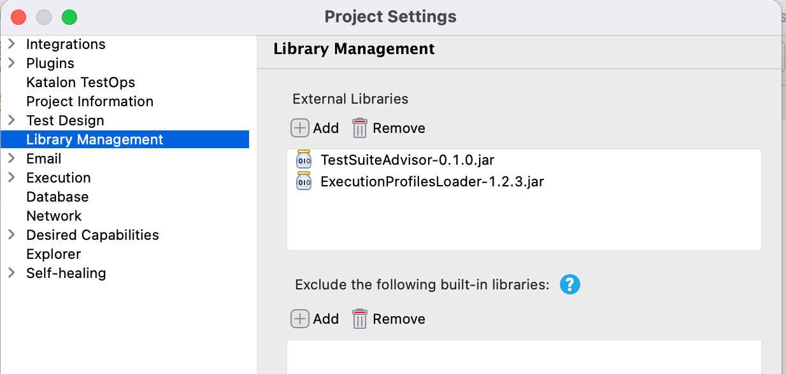

= How to let Test Cases in a Test Suite to quit once a Test Cases failed

== Problem to solve

A topic in the Katalon User Forum https://forum.katalon.com/t/stop-all-test-suite-if-one-test-case-failed/49629[Stop all test suite if one test case failed] wrote :

[quote]
----
Hi,
there is a way to stop a test suite if one of its cases fails?
I need some method or form to stop the suite, does anyone have a solution?
----

Fair enough requirement, I think. 
Let me assume I have a Test Suite `TS1` is comprised with 3 Test Cases: `TC1`, `TC2`, `TC3`. 
 The `TC3` runs very long (e.g, 20 minutes). The `TC2` normally passes but occasionally fails.
When I run the `TS1` and unfortunately the `TC2` failed, I want the `TS1` stops as soon as the `TC2` failed.
I do not want to wait for the `TC3` to finish after 20 minutes.

However Katalon Studio does not support the feature to stop a Test Suite when a comprising Test Case failed.

What else can I do practically to let a Test Suite to finish as soon as a Test Case failed?

== Solution

I will not ask Katalon Studio to control if it should invoke each Test Cases (TC1, TC2, TC3) or not.
I will let it invoke all Test Cases in a Test Suite as defined.

Rather, I would write *each Test Cases to check if any of preceding Test Cases in the Test Suite has failed*. 
If there are any failed Test Cases, then a Test Case should quit immediately. A Test Case should check it before executing the body of test processes to prevent consuming time. I will introduce a few custom Groovy classes. A jar file that includes the module will be provided. Provided that Test Cases are informed of the results of preceding Test Cases, following Test Cases can be self-deterministic.

== Demonstration

You want to run `Test Suites/TSa`. The `TSa` is comprised with 3 Test Cases: `TS1_passes`, `TS2_passes`, `TS3_passes`. When you run `TSa`, all of component Test Cases will pass.

image::docs/images/TSa.png[TSa]

Next, please run the `Test Suites/TSb`. The `TSb` is comprised with 3 Test Cases: `TS1_passes`, `TS2_fails`, `TS3_passes`. When you run it, `TS2_fails` will fail intentionally, and **`TS3_passes` quits soon before doing any meaningful actions**.

image::docs/images/TSb.png[TSb]

As you see, the `TSb` can shorten the duration required for the `TC3` after the failed `TC2`.

Yes, Katalon Studio still executes all of 3 Test Cases defined in the Test Case `TSb`. But the Test Cases are coded so that they quit soon if one or more preceding Test Cases failed. Therefore `TSb` can eliminate redundant duration.

== How you should write your code

=== Test Cases

I wrote 4 Test Cases.

==== link:Scripts/TC1_passes/Script1638068375427.groovy[TC1_passes]

[source,groovy]
----
include::Scripts/TC1_passes/Script1638068375427.groovy[]
----

==== link:Scripts/TC2_fails/Script1638068381665.groovy[TC2_fails]

[source,groovy]
----
include::Scripts/TC2_fails/Script1638068381665.groovy[]
----

==== link:Scripts/TC2_passes/Script1638068635076.groovy[TC2_passes]

[source,groovy]
----
include::Scripts/TC2_passes/Script1638068635076.groovy[]
----

==== link:Scripts/TC3_passes/Script1638068553061.groovy[TC3_passes]

[source,groovy]
----
include::Scripts/TC3_passes/Script1638068553061.groovy[]
----

==== Design

`com.kazurayam.ks.testsuite.Advisor` is a Custom Groovy class that I developed. This is included in the `TestSuiteAdvisor-x.x.x.jar` file. A call to `Advisor.shouldQuit()` would return a Boolean value. If one or more preceding Test Cases in a Test Suite have failed, then `shouldQuit()` will return true. Then the test case should decide; if it wants to, it can quit immediately by calling the statement `return;`

Katalon Studio will ignorantly trigger your Test Cases, and your Test Cases are supposed to choose for themselves. This is a sort of https://en.wikipedia.org/wiki/Inversion_of_control#:~:text=In%20software%20engineering%2C%20inversion%20of,control%20from%20a%20generic%20framework[Inversion of control].

==== Test Listener
 
You will wonder how `Advisor` is informed of the status preceding Test Cases (passed or failed)? The trick is performed by a Test Listener.

link:Test%20Listeners/TL1.groovy[Test Listeners/TL1]

[source,groovy]
----
include::Test Listeners/TL1.groovy[]
----

The `TL1` delegates another custom class `com.kazurayam.ks.testsuite.ProgressListener` to inform the `Advisor` of the status (`PASSED` or `FAILED`) of all Test Cases.

The Test Listener is not bundled in the jar file.
You need to write a Test Listener like this manually. 
You can just copy and paste the above code. 

== Other source codes

The source code of the other classes are disclosed on another GigHub repository. Please have a look if you are interested in the internal.

- https://github.com/kazurayam/TestSuiteAdvisor/blob/master/Keywords/com/kazurayam/ks/testsuite/Advisor.groovy[`com.kazurayam.ks.testsuite.Advisor`]
- https://github.com/kazurayam/TestSuiteAdvisor/blob/master/Keywords/com/kazurayam/ks/testsuite/ProgressEntry.groovy[`com.kazurayam.ks.testsuite.ProgressEntry`]
- https://github.com/kazurayam/TestSuiteAdvisor/blob/master/Keywords/com/kazurayam/ks/testsuite/ProgressListener.groovy[`com.kazurayam.ks.testsuite.ProgressListener`]

== Dependencies

At the https://github.com/kazurayam/TestSuiteAdvisor/releases[Releases] page, you can download the jar of `TestSuiteAdvisor-x.x.x.jar`. You want to copy that jar into your project's `Drivers` folder.

TestSuiteAdvisor internally depends on the https://github.com/kazurayam/ExecutionProfilesLoader/releases[ExecutionProfilesLoader] project's jar. You want to copy the jar into your project's `Drivers' folder as well.

See the following screenshot how the `Drivers` folder would look like:

